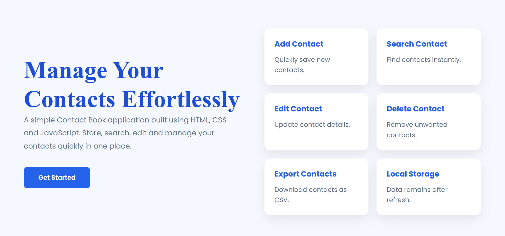
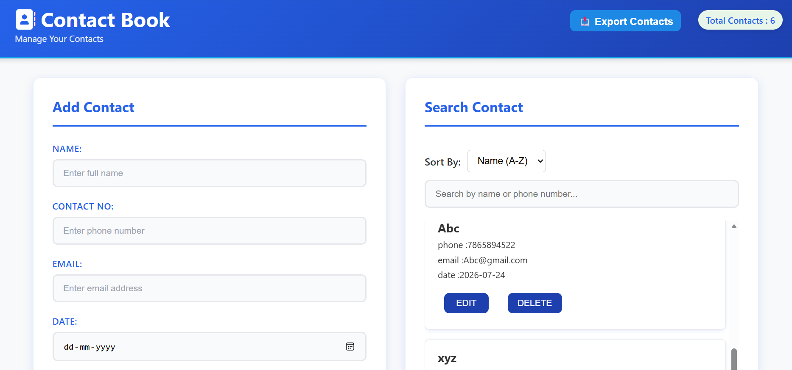
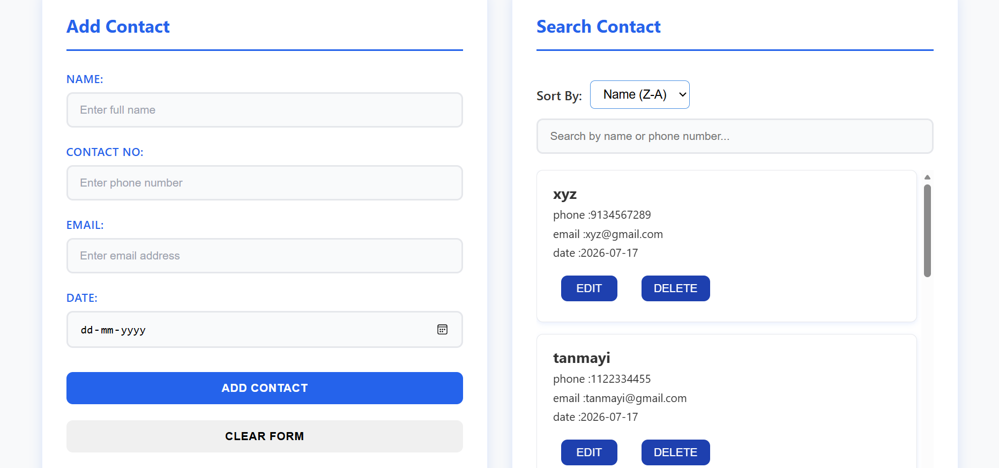
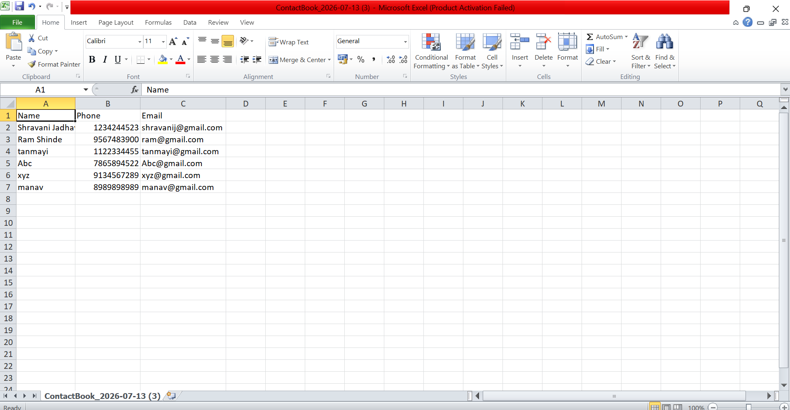

# 📇 Contact Book

A simple and responsive **Contact Book application** built using **HTML, CSS, and JavaScript**.

## Features

* ✅ Add Contact
* ✅ View All Contacts
* ✅ Edit & Update Contact
* ✅ Delete Contact with Confirmation
* ✅ Search Contacts
* ✅ Sort Contacts (A–Z / Z–A)
* ✅ Display Total Contact Count
* ✅ Input Validation (Username, Email, Mobile Number)
* ✅ Local Storage Support
* ✅ Export Contacts as CSV
* ✅ Responsive User Interface
* ✅ Landing Page

## Screenshots

### Landing Page


### Contact Book Page


### Search & Sort


### Export Contacts as CSV


## Technologies Used

* HTML5
* CSS3
* JavaScript (ES6)
* Local Storage
* CSV File Handling

## Project Structure

```text
ContactBook/
│── index.html
│── style.css
│── contactbook.html
│── contactbook.css
│── contactbook.js
│── README.md
```

## How to Run

1. Clone the repository.
2. Open the project in VS Code.
3. Open `index.html` in your browser.

## Future Improvements

* 🌐 Express.js Backend
* 🍃 MongoDB Database
* 🔐 User Authentication
* 📥 Import Contacts from CSV
* 🌙 Dark Mode

## Live Demo

🔗 https://shravanijadhav09.github.io/Contact-Book/

## Author

**Shravani Jadhav**
